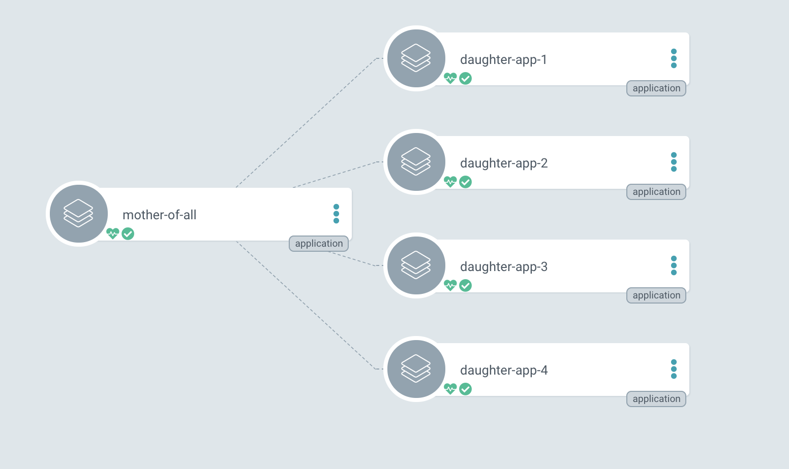

# ArgoCD Application of Applications

This repository contains a working example of the "Application of Applications" concept in ArgoCD.
- The main application is `mother-of-all-applications` and it can be created by running `kubectl -f mother-of-all-applications.yaml`
- The mother application calls the different daughter applications, defined in applications/templates.

## ArgoCD Diagram

